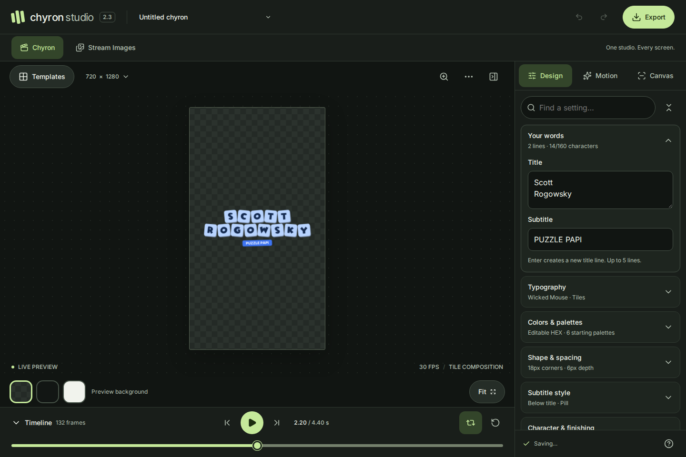

# Chyron Studio

A browser-based motion graphics editor rebuilt from the original Chyron Generator. Create animated tile titles and expressive typography, then export them with a real alpha channel.



## Run locally

Requires Node.js 22.12+ (Node.js 24 is also supported).

```bash
npm ci
npm run dev
```

Open the URL printed by Vite, usually `http://localhost:5173/chyrongenerator/`.

```bash
npm run build
npm run preview
```

The application remains compatible with GitHub Pages at `/chyrongenerator/`. The deployment command is still `npm run deploy`. Set `base` in `vite.config.ts` if you host it at a different path.

## What’s new in 2.5 — Image layers

Chyron Studio now builds complete motion graphics: stack logos, photos and your chyron in one project, animate each one, and export the result with alpha. Graphics like the SHOWDOWN intermission bumper or an Affidavit card no longer need a separate editor.

- **Add images** with the **Image** button in the canvas toolbar, the new **Layers** tab, or by dropping files onto the canvas. PNG, JPEG, WebP and GIF are supported, up to 25 MB each; images larger than 4096 px are downscaled. PNG transparency is preserved. Up to 12 images per composition.
- **Smart placement.** A JPEG shaped like the canvas arrives full-bleed at the back of the stack with a soft fade. Everything else arrives centered on top with Pop.
- **Layers.** The chyron is one layer in the stack. Reorder (front, forward, backward, back), duplicate, delete, rename and hide layers. Hide the chyron for image-only graphics.
- **On-canvas editing.** Click any layer to select it. Drag to move (snaps to the canvas center and edges), drag a corner to resize, drag the top handle to rotate; Shift snaps to 15°. Arrow keys nudge; Delete removes the selected image.
- **Placement and frame.** Fit, Fill, Center and Lower third; size, position (including partly off-canvas), rotation, opacity, mirror, corner roundness, border and a drop shadow that follows transparent edges.
- **17 intro styles:** Soft fade, Pop, Burst (sparks and a flash), Rise, Drop (bounce), From left, From right, Zoom, Slam (screen shake), Spin, Flip, Swing, Wipe, Iris, Focus, Glitch (RGB split) and Cut.
- **Outros** mirror the intro by default, or use any style (“To left”, “To right”, …). Choose Signature, Smooth, Snappy, Bounce, Elastic or Linear easing.
- **Timing per layer.** Each image has its own transition length and start delay; the chyron has a start delay too. Delays are mirrored in the outro, so every layer is gone by the last frame. The clip length still comes from the chyron’s Animation duration and Hold. Intro/outro previews cover the longest layer.
- **While on screen:** Pulse, Float, Sway, Ken Burns (a slow push into the picture inside its frame), Shine and Rumble, with strength and cycle length.
- **Timeline** shows one track per image with its delay, intro, hold and outro.
- **Exports.** PNG, PNG sequence, WebM and ProRes include every visible layer, and animated exports still start and end fully transparent. SVG embeds the images with their position, motion, frame and shadow; Glitch, Shine and Burst sparks are canvas-only effects and are omitted from SVG.
- **Saving.** Images are stored in IndexedDB on this device, separate from the autosaved project, and survive reloads and undo. **Save project file** embeds the images, so `.chyron.json` files reopen complete on any device; PNG sequence ZIPs embed them in `project.chyron.json` too. Files from earlier versions open unchanged as a single chyron layer. Unused images are cleaned up when the editor opens.

### A high-end shell

- **One flat frame.** Edge-to-edge surfaces separated by hairlines replace the floating cards. The top bar holds the logo and the **Chyron | Stream Images** switch on the left, the project name in the center and history, theme and Export on the right. The side rail is gone, so the canvas gets that space.
- **A dotted stage with one floating toolbar**: canvas size (opens Composition), zoom to artwork, preview options and hide/show properties.
- **Flat property sections** with hairline dividers; Composition shows size as width × height with lock and swap buttons, and frame rate as a 24 / 30 / 60 switch.
- On phones the top bar folds into two rows and the workspace switch becomes icons below 380 px.

### A simpler editor

Everything now lives where you would look for it:

| Where                   | What                                                                                                                                                   |
| ----------------------- | ------------------------------------------------------------------------------------------------------------------------------------------------------ |
| **Timeline** (bottom)   | Playback, the time ruler and the layer stack. Each row is a layer: click to select it, use the eye to hide it, **Image** adds a new one.               |
| **Properties** (right)  | Settings for whatever is selected. The chyron and images share the same two tabs: **Design** and **Animate**.                                          |
| **Composition**         | Select nothing (Esc, click empty space, or the canvas-size button) to edit canvas size, transition length, hold and frame rate.                        |
| **Style**               | Presets and your saved styles sit at the top of the chyron's Design tab. They restyle the chyron without changing its words, canvas, timing or layers. |
| **Preview options** (⋯) | Preview background, safe area and fullscreen.                                                                                                          |

Removed: the separate Motion and Canvas tabs, the Layers tab and its sub-tabs, the Templates dialog, the settings search, the preview-background bar and redundant labels.

### Faster editing

- **Pick a style to see it.** Choosing an intro or outro plays it on the canvas immediately, then returns to the fully visible frame.
- **Shape time in the timeline.** Drag a bar to change when a layer starts (snapped to frames), drag its left edge marker to change the transition length, and drag layer names to reorder the stack.
- **Share an animation.** "Use this animation on N other images" copies intro, outro, easing, length and on-screen effect to every other image.
- **Shortcuts:** Space play/pause · ←/→ step a frame · Esc composition settings · ⌘/Ctrl D duplicate image · `[` / `]` send backward / bring forward · H hide/show · Del delete image · ⌘/Ctrl Z undo (⇧ redo) · ⌘/Ctrl S save project file · arrows on the canvas nudge · `?` guide.
- **Compact density.** Every setting is one row (label · control · value) on desktop; touch screens switch to 44 px targets automatically.

### More motion

- **Chyron: 24 per-letter styles in six groups of four.** Simple (Fade, Pop, Rise, Still), Bouncy (Drop, Bounce, Wave, Elastic), Move (From left, From right, Split, Scatter), Turn (Flip, Spin, Swing, Cascade), Impact (Zoom, Stamp, Slam, Shake), Reveal (Reveal, Typewriter, Blink, Glitch). Stagger applies to all of them.
- **Images: 24 intro/outro styles in six groups of four.** Simple, Punchy (Burst, Slam, Drop, Bounce), Springy (Swing, Stretch, Unfold, Flip), Move (From left/right/top/bottom), Turn (Spin, Roll, Zoom, Focus), Reveal (Wipe, Iris, Glitch, Flicker).
- **While on screen: 12 effects.** Pulse, Float, Sway, Ken Burns, Shine, Rumble, Wiggle, Heartbeat, Orbit (whole turns that end exactly upright), Glow and Jelly.
- Every style starts and ends fully transparent at 24, 30 and 60 fps, and every outro retraces its intro; the unit tests check all of them.

### Look and feel

- Visual language adapted from the Magnific design system (near-black `#080808` surfaces, Geist type, pill-shaped buttons) with a blue accent: `#4c8dff` with dark text in the dark theme (5.9:1), `#1e5bd8` with white text in the light theme (5.9:1).
- **Light and dark themes** follow the system until you pick one with the sun/moon button; the choice is remembered and applied before first paint.
- One token system in `src/index.css`: components never use raw colors, apart from on-canvas tools that sit over your artwork. One radius scale; buttons are pills, fields and cards 10–12 px, panels 16 px.
- Compact controls for mouse and trackpad meet WCAG 2.2 AA target size (24 px); on touch screens they grow to 44 px.
- Both themes pass automated WCAG 2.2 AA checks, including contrast, across chyron and image settings, composition, the preview menu, export and Stream Images.

Lossless video with alpha is encoded in the browser, and photographic images make that much slower than text alone: expect minutes for a few seconds of 720p. ProRes is roughly twice as fast as WebM, and a PNG sequence is fastest. Lossy VP9 was tested and rejected because it leaks faint alpha into the first and last frames.

## What’s new in 2.4

- A blue interface throughout the header, navigation, workspace, inspector and controls.
- Stream Images starts with on-canvas transform controls enabled: drag to move, drag a corner to resize proportionally with the opposite corner fixed, or drag the top handle to rotate. Hold Shift while rotating to snap to 15°. Toolbar actions fit, flip and hide/show the controls. Keyboard arrows work on the canvas and handles; Host framing retains numeric controls.
- The supplied **Live preview** photo is the default Chyron preview background. It is a CSS layer outside the renderer and never appears in PNG, SVG, sequence or video exports. Checker, dark, light and custom backgrounds remain available.
- New compositions use **720 × 1280 (720p)**, Fredoka tiles at **128 px**, uppercase and centered. Shape defaults: **24 px** corners, **16 px** letter padding, **8 px** tile spacing, **16 px** line spacing and **8 px** depth.
- Subtitle defaults: pill enabled, **64 px** type, **32 px** gap, **24 px** radius and **24 × 32 px** padding. Turning off **Subtitle pill** now hides both the pill and its text, removes their layout spacing and preserves the text for re-enabling.
- The editor opens paused on the fully visible composition. Intro/outro timing remains one second each. Saved drafts keep their values; **Project menu → New composition** applies the new defaults, while group Reset actions update individual sections.

## What’s new in 2.3 — Stream Images

**2.3.1 layout update:** The header, desktop tool rail, canvas and inspector now have separate surfaces, visible borders and 12 px gutters. Canvas backgrounds are quieter, selected tools are clearer, and mobile keeps compact horizontal navigation with 8 px gutters.

Open **Stream Images** beside Chyron to create a complete image set from one host upload. Each output keeps its own background and framing:

| Output       | Exact PNG size    | Default background      |
| ------------ | ----------------- | ----------------------- |
| Hero image   | 900 × 1200 · 3:4  | Blue grid               |
| Host card    | 1024 × 1024 · 1:1 | Editable color gradient |
| Stream image | 1200 × 1200 · 1:1 | Savvy                   |

- The supplied Blue grid, Savvy and Super Savvy backgrounds are bundled unchanged. Upload your own backgrounds, or choose a gradient, solid color or transparency.
- Upload a host once; all three previews update. Transparent padding is ignored when fitting the host. Drag to position, adjust size/rotation, flip, add a shadow or fade, and customize each image independently.
- Download one full-resolution PNG or all three in one ZIP. Preview guides are excluded. Preview, thumbnail and download use the same renderer.
- Images and settings save together in IndexedDB on this device. Undo/redo is separate from the Chyron editor; switching tools keeps both projects and their in-session history.
- PNG, JPEG and WebP are supported, up to 20 MB / 24 megapixels per image. Use a transparent PNG for a cutout: this feature composites uploaded images and does not remove photo backgrounds.

See [Stream Images guide](docs/stream-images.md) for workflow, limits and validation. The original Chyron animation and alpha export features remain available in the **Chyron** tab.

## What’s new in 2.2

- Material 3 typography roles with 12/14/16/22/24 px text and 48 px interaction targets. Inter stays the interface typeface.
- Twelve collapsible settings groups with live summaries, global settings search, expand/collapse controls, persistent panel state and per-group resets that work with undo.
- Templates open in a searchable modal; the timeline folds into a compact transport bar. Focus canvas hides the inspector when you need more room.
- Mobile and tablet layouts keep a preview above independently scrolling controls. Live preview shows the complete frame on narrow screens. Other backgrounds default to a labeled cropped detail view in Design/Motion; the zoom button switches between full frame and artwork detail. Canvas settings and focus mode show the complete frame. Preview zoom never changes exported pixels.
- Editable 3/6-digit HEX colors, letter case, typography tracking, subtitle styling, custom canvas dimensions with aspect lock/swap, composition rotation and group opacity.
- Improved keyboard behavior: native button activation, arrow-key tabs and export choices, modal focus return, and undo for deleted presets. Choosing a template retains canvas, timing and placement.
- The export action remains visible while format choices scroll. The portrait 720p default, shared 1-second intro/outro duration and transparent exports are retained.

See [UX/UI audit (Türkçe)](UX_UI_AUDIT.md) for findings, evidence, typography mapping and validation scope.

## Studio features

- A responsive studio interface with six starting templates, a live canvas, Design / Motion / Canvas controls, safe-area guides and a timeline.
- Tile and Typography modes in one editor. Ten bundled typefaces, seven typography effects, subtitle controls, palettes, rotation, depth, scatter and scale variation.
- New compositions default to the app's **720 × 1280 portrait canvas (720p)** at 30 fps. Other canvas presets remain available.
- Pop, Flip, Rise, Reveal, Typewriter and Soft fade animations, plus a still mode. Each outro reverses the intro's motion, easing and letter order.
- One **Animation duration** input controls both transitions and defaults to **1 second each**. Hold and stagger remain adjustable; the default clip is 1s intro + 2.4s hold + 1s outro.
- Preview intro or outro independently, or play the full clip with pause, restart, loop, scrub and frame stepping. Phase previews play once regardless of the loop setting. Space toggles playback; arrow keys move one frame. Animated exports start and end fully transparent.
- Autosave, grouped undo/redo, saved presets, portable `.chyron.json` projects and migration of legacy drafts and presets. A failed storage write is visible in the editor.
- A single deterministic renderer shared by preview and export. Rendering no longer waits for React or captures a responsive DOM layout.
- Export progress, cancellation, retry and download-again controls. The export uses an immutable project snapshot.

Saved projects retain their canvas dimensions. Earlier v2 projects with separate entrance/exit durations use their saved entrance length for the new shared duration. The portable project format remains version 2 and now stores `animationDuration`.

## Export formats

| Format             | Alpha                                       | Workflow                                                                                      |
| ------------------ | ------------------------------------------- | --------------------------------------------------------------------------------------------- |
| WebM / VP9         | Yes, `yuva420p`                             | OBS, overlays and compatible web players. Lossless VP9 encoding after 4:2:0 color conversion. |
| MOV / ProRes 4444  | Yes, `yuva444p10le`, 16-bit alpha component | Premiere, After Effects, Final Cut and compositing workflows.                                 |
| PNG sequence / ZIP | Yes, RGBA                                   | Lossless frame sequence, project JSON and import instructions.                                |
| PNG                | Yes, RGBA                                   | Full composition or selected playhead frame.                                                  |
| SVG                | Yes                                         | Standalone vector paths. No external fonts, `<text>` or `foreignObject`.                      |

All formats exclude the preview background and safe-area guides. A deliberately enabled **Soft dark backdrop** is part of the artwork and is included. Still exports default to the settled composition; select the current-frame checkbox to export the exact playhead frame instead.

Video exports are capped at **2,073,600 pixels per frame and 600 frames** to keep browser memory usage practical. Full HD landscape, Full HD portrait, 24/30/60 fps and shorter square videos are supported. Larger canvases, including 4K, can be exported as PNG sequences or stills. Encoding speed depends on the device; it is not real-time screen recording.

The video encoder is a single-threaded FFmpeg WebAssembly worker, loaded from the same origin on first use (about 32 MB). No server, upload, runtime CDN or cross-origin isolation headers are required. Cancellation terminates the worker; every subsequent job gets a fresh encoder. VP9 uses the `good` deadline because the realtime/lossless combination failed the browser export regression checks.

The old `webm-writer` pipeline was removed: its canvas/WebP alpha conversion can clamp fully transparent and opaque values. Tests decode the new video files and inspect their alpha planes rather than relying on container metadata.

Canvas input is 8-bit RGBA. ProRes' higher-bit-depth storage does not create extra source precision. VP9 preserves alpha but uses 4:2:0 color; PNG sequences preserve the original RGBA pixels. A player that cannot composite alpha may display a black background even when the file is correct.

To convert a PNG sequence with native FFmpeg:

```bash
ffmpeg -framerate 30 -i frame-%05d.png \
  -c:v prores_ks -profile:v 4 -pix_fmt yuva444p10le \
  -alpha_bits 16 chyron-alpha.mov
```

Use the frame rate recorded in the ZIP's README, rather than assuming 30 fps.

## Verify

```bash
npm run check
npx playwright install chromium
npm run test:e2e
```

The browser suite requires native `ffmpeg` and `ffprobe` on PATH. It checks 720 × 1280 Flip exports as actual PNG, SVG, ZIP, VP9 and ProRes downloads, video duration/frame count, decoded alpha endpoints, opaque artwork and partial alpha, the shared duration input, intro/outro previews, editing, autosave, undo/redo, cancellation and mobile layout. `CHYRON_CHROMIUM_PATH` can point to a preinstalled Chromium binary in constrained environments.

The UX browser suite checks disclosure, search, numeric input, preset recovery, keyboard focus, seven viewport sizes, 200% text scaling and axe checks on the three inspector tabs, color controls, templates and export. It also decodes a 50%-opacity PNG to verify that opacity applies to the whole composition.

Unit tests cover new customization defaults and validation, preservation of user settings when applying a template, reversed intro/outro symmetry, long-text stagger completion, deterministic seeking, frame-boundary transparency at 24/30/60 fps, default dimensions/timing, legacy migration and malformed project imports. `npm run build` includes TypeScript checking.

Stream image tests verify the exact three PNG dimensions, decoded background/host pixels, transparent output, independent framing, drag/keyboard editing, failed-upload recovery, image persistence after reload, tool switching and responsive/accessibility checks. Synthetic cutouts are used as test fixtures. The user-supplied live screenshot is bundled only as a Chyron preview background, separately from Stream Images assets.

## Code map

- `src/studio/model.ts`: versioned project schema, layer schema, validation, templates and legacy migration.
- `src/studio/motion.ts`: pure time-to-pose animation math for the chyron and image layers.
- `src/studio/layers.ts`: pure layer operations (add, reorder, duplicate, remove, fit).
- `src/studio/assets.ts`: IndexedDB image storage, decoding cache and project-file embedding.
- `src/studio/fonts.ts`: self-hosted font loading and glyph outlines.
- `src/studio/renderer.ts`: shared scene layout, layered canvas compositing and standalone SVG serialization.
- `src/studio/export.ts`: frame rendering, PNG/ZIP output and isolated FFmpeg encoding.
- `src/studio/useProject.ts`: history, persistence and presets.
- `src/studio/usePlayback.ts`: one cancellable animation clock.
- `src/components/`: composition preview, inspector, layers panel, timeline and export dialog.
- `src/stream/`: Stream Images workspace, image loading, per-format composition, IndexedDB drafts and PNG/ZIP exports.

## Fonts and dependencies

Geist Sans (interface) and display fonts are bundled via Fontsource; their license files ship in the respective npm packages. The existing Wicked Mouse font and its original license/readme have been retained. Check `public/assets/fonts/wicked_mouse/readme.txt` for the original font's usage terms. FFmpeg core is GPL-2.0-or-later; keep the relevant notices and comply with its license when distributing the application.

Useful upstream references: [FFmpeg codecs](https://ffmpeg.org/ffmpeg-codecs.html), [ffmpeg.wasm](https://ffmpegwasm.netlify.app/), [Fontsource](https://fontsource.org/).
