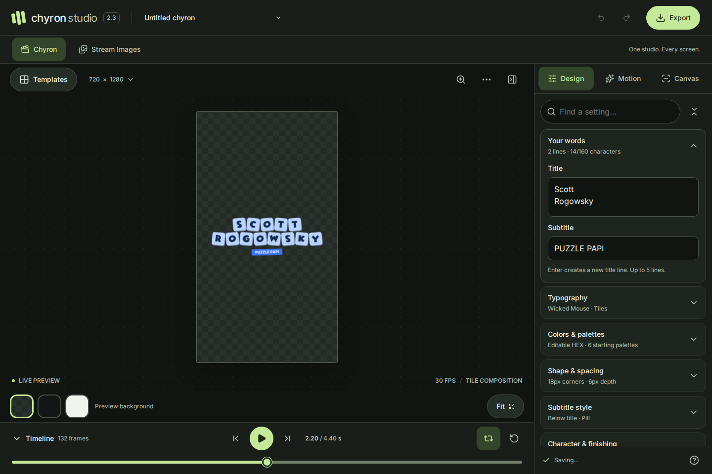

# Savvy Editor

A browser-based motion graphics editor rebuilt from the original Chyron Generator. Create animated tile titles and expressive typography, then export them with a real alpha channel.



## Run locally

Requires Node.js 22.12+ (Node.js 24 is also supported).

```bash
npm ci
npm run dev
```

Open the URL printed by Vite, usually `http://localhost:5173/chyrongenerator/`.

```bash
npm run build
npm run preview
```

The application remains compatible with GitHub Pages at `/chyrongenerator/`. The deployment command is still `npm run deploy`. Set `base` in `vite.config.ts` if you host it at a different path.

## What's new in 3.6 — Apps, Hero image generator and a pro timeline

- **Apps.** A new **Apps** place in the navigation lists ready-made tools. Stream images moved here and grew into the Hero image generator; a set made in Stream images opens there with its host, framings, backgrounds and colours.
- **Hero image generator (Stream images, upgraded).** The hero image (900 × 1200), host card (1024 × 1024) and stream image (1200 × 1200) are artboards side by side on one canvas. Everything Stream images did is in the panel on the right, for the artboard being edited: the host photo (shared by every artboard, from the Media gallery or your device, or dropped on the canvas), framing (size, rotation, position, flip), the background (built-in images, your own, gradient, solid or none, with the colour styles and **Use this background for all**), host shadow, bottom shadow and bottom fade. Click any artboard (its name, or its row in **Artboards**) to edit it; drag, resize or turn the host right on the canvas. **+** adds an artboard in another size, starting with the look of the one being edited; the Artboard section changes a size and the look follows. On top, add any Designer layer — text, logos, shapes, frames, chyrons — and **Copy to other artboards** (right-click a layer) puts it in every size at the same place, scaled to fit. **Download set** makes every artboard as a full-size PNG in one ZIP; its menu downloads only the artboard being edited or opens **Export options** (pick artboards, PNG, JPEG or WebP, 1× or 2×). The set autosaves on this device and saves as one `.savvy`; one undo history covers everything.
- **Adding lives in the top toolbar, in every editor.** The Chyron editor, the Designer and the Hero image generator show the same icons in the same order next to the tools — Chyron, Text, Shape, **Line**, **Frame**, Image (and Music in the Chyron editor) — and their choices open below them. Shapes come in the same list everywhere (Rectangle, Circle, Arch, Triangle, Hexagon, Star, Heart). **Line** adds a thin rule you can stretch, turn and recolour; in the Chyron editor **Frame** picks a shape and then a picture to put in it. Nothing floats over the artboard any more and the timeline keeps to timing. When the editor is narrow the tools take a row of their own.
- **Text is text.** In the Chyron editor, **T** now adds plain text as the Designer does (Heading, Subheading or Body text) instead of another chyron. Its words wrap in a box that grows with them; set the typeface, size, colour, alignment, line height, letter spacing and all caps on the right. A corner scales the letters with the box, a side makes the box wider or narrower, and a double-click on the canvas brings back its words. Text animates and stacks like images and shapes, draws the same in every export (SVG included) and has its own limit of 16, so it no longer uses up chyrons.
- **One look on every canvas.** Selection boxes, corner and edge handles, the rotate handle, snapping guides and their labels, and the Locked badge are the same in the Chyron editor, the Designer and the Hero image generator: blue selection with small white handles, pink guides. The logo and the browser tab icon are the show's glasses icon.
- **Menus are never cut off.** Every menu and add panel opens above the page, next to its button, flipping up or sideways where there is no room, so ones opened from scrolling lists (artboards, layers) show in full.
- **Cut the music.** Put the playhead where it should be cut and press **S** (or ✂ in the timeline): the music becomes parts. Drag a part to move it, drag its ends to trim it, pick it and press Delete to cut it out (silence stays in its place), or **Join the parts** to play it in one piece again. The round dots on the music set the fade in and out, the bar in the middle its volume. The Music panel lists the parts with their start, the place in the song they play from and their length. Alt + ← / → move the selected clip or part by a frame (⇧ by a second).
- **A shadcn/ui look, light and dark.** Neutral colours with more contrast, outlined inputs, hairline shadows, tab-list segments and tabs, and cards with borders; the navigation rail sits right on the page. Selected options (backgrounds, formats, masks, parts) show the brand blue, like the selection on the canvas.
- **A timeline for real editing.** Zoom with ⌘ + scroll (or pinch) at the pointer, the − / + buttons or **Fit**; the clips scroll sideways while the layer names stay put, and the view follows the playhead while playing. The ruler adapts from minutes down to single frames. Dragging a clip or any of its edges snaps to the playhead, the start and end, other clips' edges and the music (magnet button; hold Alt to move freely), with a guide showing the time. Click the current time to switch between seconds and minutes:seconds:frames. Drag the top edge of the layers (or use the arrow keys on it) to make the timeline taller. ⇧ ← / → step a second, Home and End jump to the ends, and double-clicking a clip opens its timing.

## What's new in 3.5 — Layers, music and cut-outs

The Chyron editor now builds whole graphics packages in one file.

- **Several chyrons in one export.** **Add** in the timeline adds a **Chyron** (title and subtitle in the look of your first one, smaller and in a free band), plain **Text**, a **Shape**, an image or **Music**. Every chyron has its own words, style, placement and animation; templates and saved styles restyle only the selected one. Double-click a chyron to type. Up to 8 chyrons and text layers, 16 shapes and 12 images.
- **Shapes.** Rectangle (a lower-third bar by default), circle, arch, triangle, hexagon, star and heart, with a solid, linear or radial fill, round corners, border and shadow. Side handles stretch them; corners scale.
- **One animation system for every layer.** Each layer's Animate tab has the same parts: In, Out, Timing and While on screen. Text animates letter by letter (24 styles, now with its own Out style instead of always reversing); images and shapes move as one piece (24 styles). The on-screen effects (Pulse, Float, Sway, Shine, Rumble, Wiggle, Heartbeat, Orbit, Glow, Jelly) work on chyrons, images and shapes alike; text adds **Letter wave** and **Ripple**, images keep **Ken Burns**. "Use this animation on…" copies an animation to the other layers of the same family.
- **Music.** Add an MP3, WAV, M4A, OGG or FLAC file (up to 80 MB, 20 minutes). It shows as a waveform under the layers; drag it to change when it starts. Choose which part of the song plays, volume (0–200 %), fade in and out, loop and mute. It plays with the preview, and WebM (Vorbis), ProRes (PCM) and PNG sequences (`music.wav`, already trimmed and faded) include it. Project files embed it.
- **Longer holds.** Hold goes up to 60 seconds. WebM is encoded in parts that are joined at the end, so only a few hundred frames sit in memory at a time: 720 × 1280 at 30 fps exports up to 90 seconds, Full HD up to 40. ProRes stores every frame whole and keeps its single-pass budget (45 and 20 seconds). The export dialog shows the limit for your size and frame rate; PNG sequences have no limit.
- **Exports keep going in the background.** Rendering no longer waits on timers, which browsers slow to a crawl in background tabs, so switching to another app no longer pauses an export. The tab title shows the progress, and the page asks the browser not to freeze it while exporting.
- **Remove background.** In an image's Design tab (or its ⋯ menu): **Subject** finds the person or object with a bundled U²-Netp model (4.6 MB, loaded once, Apache-2.0) and **Colour** removes a picked colour, optionally only where it touches the edge. Edge softness and shrink/grow refine the result, a compare toggle shows the original, and **Restore original** brings it back. Everything runs on the device with ONNX Runtime Web; nothing is uploaded.
- **Cropping is easier to find.** Crop and Remove background sit at the top of every image's Design tab, in its ⋯ menu and on **C**; a new image offers Crop in its toast.
- **Where is my work?** Click the save status (or Project menu › Where is my work?) to see what is stored where: autosave lives in this browser on this device (with how much space it uses and an option to keep it when space runs low); **Save project file** writes one `.savvy` file with every image and the music. In Chrome and Edge you choose the folder the first time and later saves update the same file (**Save as…** / ⇧⌘S picks a new one); other browsers save to the downloads folder, and the message after saving says which.

- **Every element can be deleted**, the starting chyron included: right-click it and choose Delete layer, or select it and press Del; undo brings it back. A composition can be empty, and a chyron added to an empty canvas takes the middle at full size. New compositions still start with one chyron to edit.
- **Layer actions sit on the layer.** Right-click a layer on the canvas or in the timeline, or use the ⋯ on its timeline row, for one menu named after it: Edit text (chyrons) or Crop, Remove background and Replace image (images), then Bring to front, Bring forward, Send backward, Send to back, Hide, Lock, Rename, Duplicate and Delete. The ⋯ in Properties shows the same list, and the music track has its own (Replace, Mute, Remove). On phones the menu opens as a sheet from the selected row's ⋯. ⇧ ] and ⇧ [ bring a layer to the front or send it to the back, and [ ] also work on keyboards that type brackets with Option or AltGr. Deleting, reordering, hiding or duplicating is always one undo step of its own.
- **Panels that show what they hold.** The Animate tab is four named sections, each with its current value in the heading (In · Out · Timing · While on screen), so on-screen effects are in view without scrolling. A longer Hold in a layer's Timing makes the whole clip longer. New images open on their Design tab, where Crop, Remove background and Replace are named tiles; on phones the canvas scrolls into view for cropping. The save status reads "Saved on this device" and opens Where is my work?. Exports say they keep going in the background and where the file went. Contrast and touch targets were checked against WCAG 2.2 AA in both themes (see `docs/USABILITY_3.5.md`).
- **Type the video length.** The length sits next to the time in the timeline and as **Length** in Composition › Timing; type a new one and the hold takes up the change (transition in + hold + transition out).
- **Designer: one floating add bar, chyrons included.** Image, Text, Shape, Frame and **Chyron** float under the artboard; the left panel lists the layers. Chyron offers the chyron from the Chyron editor (with its words) and the six styles. Its words and style are edited in the panel on the right (double-click it on the artboard to type), and it is drawn again with the Chyron editor's lettering; undo brings back the words and the picture together.
- **`.savvy` project files.** The Chyron editor and the Designer both save `<name>.savvy` (PNG sequence ZIPs carry `project.savvy`). A file opened in the other editor switches to the one it belongs to, and a `.savvy` dropped on the Chyron canvas opens too. Files saved as `.chyron.json` or `.design.json` by earlier versions still open.
- **Remove background in the Designer too.** The same on-device cut-out (Subject or Colour) is in a Designer image's Image section, on the toolbar (wand) and in its right-click menu; **Restore original** brings the picture back, and design files keep both.
- **Compact controls.** Quick placements and picture tools are 32 px chips with their names, style previews are shorter and section headings take 36 px (44 px on touch screens).
- **Space always plays.** Space plays and pauses even right after clicking a layer or a button; it still types in text fields and presses a control you reached with Tab. Focus rings are for keyboard navigation: after a click, shortcuts no longer draw rings on what was clicked (the timeline ruler, rows, the canvas, the Designer stage), and Tab brings them back; text fields always show where typing goes. Dragging a row shows a straight line where it will land.

Older projects open unchanged: their chyron becomes the first chyron, and every new setting starts at its old behaviour.

## What's new in 3.4 — Image shapes and crop in Chyron

Image layers in the Chyron editor pick up the Designer's most useful tools, without new panels:

- **Shapes.** "Shape & frame" opens with one row of shapes: rectangle, circle, arch, triangle, hexagon, star, heart. Borders follow the shape. Round shapes on a wide or tall picture crop it to a centred square first.
- **Crop.** Double-click an image on the canvas (or press Crop). Drag the handles to frame, drag inside to move the picture; 1:1, 4:5, 16:9 and Full in the bar below. Round shapes keep their proportions while cropping; Shift keeps any crop's. Enter applies, Esc cancels.
- **Snapping to layers.** Images snap to the edges and centres of other images and the chyron as well as the canvas, with a guide naming what they lined up with. Hold Alt to move freely.
- **Adjustments.** Brightness, contrast and saturation in a collapsed section.
- **Lock.** The lock in a timeline row makes the canvas ignore that layer, so you can work on what is beneath it.

Every export (WebM, ProRes, PNG sequence, PNG, SVG) renders shapes, crops and adjustments. Older projects open unchanged.

## What's new in 3.3 — Designer

A new **Designer** workspace (pen icon in the rail) is a layered image editor built on the same Magnific design system as the rest of the studio.

- **Layers.** Images, text and shapes stack bottom to top. Drag rows to reorder, hide (eye), lock, double-click to rename, multi-select with Shift / ⌘, right-click for every action.
- **Add images** by uploading, dropping, pasting from the clipboard or from the Media gallery (also "Add to Designer" in the gallery). Replace an image and keep its frame and crop.
- **Crop.** Double-click an image (or press C). Drag handles to frame, drag inside to move the picture, pick Free, Original, 1:1, 4:5, 3:2, 16:9 or 9:16. Enter applies, Esc cancels. Works on rotated and flipped images.
- **One left panel.** An add bar (Image, Text, Shape, Frame) sits above the layers list, so inserting and arranging happen in one place. Mask groups show as indented, collapsible groups.
- **Masks.** Drag a layer onto another in Layers to mask it, pick one of eight shapes in the Mask section (square, rounded, circle, arch, triangle, hexagon, star, heart), or use "Clip to layer below" (⌥⌘G). Masks can hide their own shape, invert, and feather their edge. Fit to mask, Release and Release all are one click away.
- **Frames.** Frames are masks waiting for a picture: drop a photo on one, drag an image layer onto it, or double-click it to upload. A framed picture moves with its frame; double-click (or ⌘-click) to adjust the picture inside.
- **Snapping & grid.** Edges and centres snap to the artboard and other layers with guides; optional grid with snap-to-grid. Hold Alt to move freely.
- **Transform.** Move, resize from 8 handles (Shift keeps ratio, Alt from centre), rotate (Shift for 15°), marquee select, align and distribute, nudge with arrows.
- **Style.** Opacity, 16 blend modes, drop shadow that follows transparent edges, image adjustments (brightness, contrast, saturation, grayscale, hue, blur), corner radius and borders, full text styling.
- **Canvas.** Space-drag or the Hand tool to pan, ⌘ + wheel or pinch to zoom at the pointer, ⌘0 fit, ⌘1 100 %, ⌘2 zoom to selection.
- **Saving & export.** Autosaves to IndexedDB on this device; ⌘S saves a `.design.json` with every image embedded. Export PNG, JPEG or WebP at 0.5×–3×, with or without transparency.

Press **?** inside the Designer for the full shortcut list. Code lives in `src/designer/`, styles in `src/styles/designer.css`, tests in `tests/designer.test.ts`.

## What’s new in 2.5 — Image layers

Savvy Editor now builds complete motion graphics: stack logos, photos and your chyron in one project, animate each one, and export the result with alpha. Graphics like the SHOWDOWN intermission bumper or an Affidavit card no longer need a separate editor.

- **Add images** with the **Image** button in the canvas toolbar, the new **Layers** tab, or by dropping files onto the canvas. PNG, JPEG, WebP and GIF are supported, up to 25 MB each; images larger than 4096 px are downscaled. PNG transparency is preserved. Up to 12 images per composition.
- **Smart placement.** A JPEG shaped like the canvas arrives full-bleed at the back of the stack with a soft fade. Everything else arrives centered on top with Pop.
- **Layers.** The chyron is one layer in the stack. Reorder (front, forward, backward, back), duplicate, delete, rename and hide layers. Hide the chyron for image-only graphics.
- **On-canvas editing.** Click any layer to select it. Drag to move (snaps to the canvas center and edges), drag a corner to resize, drag the top handle to rotate; Shift snaps to 15°. Arrow keys nudge; Delete removes the selected image.
- **Placement and frame.** Fit, Fill, Center and Lower third; size, position (including partly off-canvas), rotation, opacity, mirror, corner roundness, border and a drop shadow that follows transparent edges.
- **17 intro styles:** Soft fade, Pop, Burst (sparks and a flash), Rise, Drop (bounce), From left, From right, Zoom, Slam (screen shake), Spin, Flip, Swing, Wipe, Iris, Focus, Glitch (RGB split) and Cut.
- **Outros** mirror the intro by default, or use any style (“To left”, “To right”, …). Choose Signature, Smooth, Snappy, Bounce, Elastic or Linear easing.
- **Timing per layer.** Each image has its own transition length and start delay; the chyron has a start delay too. Delays are mirrored in the outro, so every layer is gone by the last frame. The clip length still comes from the chyron’s Animation duration and Hold. Intro/outro previews cover the longest layer.
- **While on screen:** Pulse, Float, Sway, Ken Burns (a slow push into the picture inside its frame), Shine and Rumble, with strength and cycle length.
- **Timeline** shows one track per image with its delay, intro, hold and outro.
- **Exports.** PNG, PNG sequence, WebM and ProRes include every visible layer, and animated exports still start and end fully transparent. SVG embeds the images with their position, motion, frame and shadow; Glitch, Shine and Burst sparks are canvas-only effects and are omitted from SVG.
- **Saving.** Images are stored in IndexedDB on this device, separate from the autosaved project, and survive reloads and undo. **Save project file** embeds the images, so `.chyron.json` files reopen complete on any device; PNG sequence ZIPs embed them in `project.chyron.json` too. Files from earlier versions open unchanged as a single chyron layer. Unused images are cleaned up when the editor opens.

### A high-end shell

- **One flat frame.** Edge-to-edge surfaces separated by hairlines replace the floating cards. The top bar holds the logo and the **Chyron | Stream Images** switch on the left, the project name in the center and history, theme and Export on the right. The side rail is gone, so the canvas gets that space.
- **A dotted stage with one floating toolbar**: canvas size (opens Composition), zoom to artwork, preview options and hide/show properties.
- **Flat property sections** with hairline dividers; Composition shows size as width × height with lock and swap buttons, and frame rate as a 24 / 30 / 60 switch.
- On phones the top bar folds into two rows and the workspace switch becomes icons below 380 px.

### A simpler editor

Everything now lives where you would look for it:

| Where                   | What                                                                                                                                                   |
| ----------------------- | ------------------------------------------------------------------------------------------------------------------------------------------------------ |
| **Timeline** (bottom)   | Playback, the time ruler and the layer stack. Each row is a layer: click to select it, use the eye to hide it, **Image** adds a new one.               |
| **Properties** (right)  | Settings for whatever is selected. The chyron and images share the same two tabs: **Design** and **Animate**.                                          |
| **Composition**         | Select nothing (Esc, click empty space, or the canvas-size button) to edit canvas size, transition length, hold and frame rate.                        |
| **Style**               | Presets and your saved styles sit at the top of the chyron's Design tab. They restyle the chyron without changing its words, canvas, timing or layers. |
| **Preview options** (⋯) | Preview background, safe area and fullscreen.                                                                                                          |

Removed: the separate Motion and Canvas tabs, the Layers tab and its sub-tabs, the Templates dialog, the settings search, the preview-background bar and redundant labels.

### Faster editing

- **Pick a style to see it.** Choosing an intro or outro plays it on the canvas immediately, then returns to the fully visible frame.
- **Shape time in the timeline.** Drag a bar to change when a layer starts (snapped to frames), drag its left edge marker to change the transition length, and drag layer names to reorder the stack.
- **Share an animation.** "Use this animation on N other images" copies intro, outro, easing, length and on-screen effect to every other image.
- **Shortcuts:** Space play/pause · ←/→ step a frame · Esc composition settings · ⌘/Ctrl D duplicate image · `[` / `]` send backward / bring forward · H hide/show · Del delete image · ⌘/Ctrl Z undo (⇧ redo) · ⌘/Ctrl S save project file · arrows on the canvas nudge · `?` guide.
- **Compact density.** Every setting is one row (label · control · value) on desktop; touch screens switch to 44 px targets automatically.

### More motion

- **Chyron: 24 per-letter styles in six groups of four.** Simple (Fade, Pop, Rise, Still), Bouncy (Drop, Bounce, Wave, Elastic), Move (From left, From right, Split, Scatter), Turn (Flip, Spin, Swing, Cascade), Impact (Zoom, Stamp, Slam, Shake), Reveal (Reveal, Typewriter, Blink, Glitch). Stagger applies to all of them.
- **Images: 24 intro/outro styles in six groups of four.** Simple, Punchy (Burst, Slam, Drop, Bounce), Springy (Swing, Stretch, Unfold, Flip), Move (From left/right/top/bottom), Turn (Spin, Roll, Zoom, Focus), Reveal (Wipe, Iris, Glitch, Flicker).
- **While on screen: 12 effects.** Pulse, Float, Sway, Ken Burns, Shine, Rumble, Wiggle, Heartbeat, Orbit (whole turns that end exactly upright), Glow and Jelly.
- Every style starts and ends fully transparent at 24, 30 and 60 fps, and every outro retraces its intro; the unit tests check all of them.

### Look and feel

- Visual language adapted from the Magnific design system (near-black `#080808` surfaces, Geist type, pill-shaped buttons) with a blue accent: `#4c8dff` with dark text in the dark theme (5.9:1), `#1e5bd8` with white text in the light theme (5.9:1).
- **Light and dark themes** follow the system until you pick one with the sun/moon button; the choice is remembered and applied before first paint.
- One token system in `src/index.css`: components never use raw colors, apart from on-canvas tools that sit over your artwork. One radius scale; buttons are pills, fields and cards 10–12 px, panels 16 px.
- Compact controls for mouse and trackpad meet WCAG 2.2 AA target size (24 px); on touch screens they grow to 44 px.
- Both themes pass automated WCAG 2.2 AA checks, including contrast, across chyron and image settings, composition, the preview menu, export and Stream Images.

Lossless video with alpha is encoded in the browser, and photographic images make that much slower than text alone: expect minutes for a few seconds of 720p. ProRes is roughly twice as fast as WebM, and a PNG sequence is fastest. Lossy VP9 was tested and rejected because it leaks faint alpha into the first and last frames.

## What’s new in 2.4

- A blue interface throughout the header, navigation, workspace, inspector and controls.
- Stream Images starts with on-canvas transform controls enabled: drag to move, drag a corner to resize proportionally with the opposite corner fixed, or drag the top handle to rotate. Hold Shift while rotating to snap to 15°. Toolbar actions fit, flip and hide/show the controls. Keyboard arrows work on the canvas and handles; Host framing retains numeric controls.
- The supplied **Live preview** photo is the default Chyron preview background. It is a CSS layer outside the renderer and never appears in PNG, SVG, sequence or video exports. Checker, dark, light and custom backgrounds remain available.
- New compositions use **720 × 1280 (720p)**, Fredoka tiles at **128 px**, uppercase and centered. Shape defaults: **24 px** corners, **16 px** letter padding, **8 px** tile spacing, **16 px** line spacing and **8 px** depth.
- Subtitle defaults: pill enabled, **64 px** type, **32 px** gap, **24 px** radius and **24 × 32 px** padding. Turning off **Subtitle pill** now hides both the pill and its text, removes their layout spacing and preserves the text for re-enabling.
- The editor opens paused on the fully visible composition. Intro/outro timing remains one second each. Saved drafts keep their values; **Project menu → New composition** applies the new defaults, while group Reset actions update individual sections.

## What’s new in 2.3 — Stream Images

**2.3.1 layout update:** The header, desktop tool rail, canvas and inspector now have separate surfaces, visible borders and 12 px gutters. Canvas backgrounds are quieter, selected tools are clearer, and mobile keeps compact horizontal navigation with 8 px gutters.

Open **Stream Images** beside Chyron to create a complete image set from one host upload. Each output keeps its own background and framing:

| Output       | Exact PNG size    | Default background      |
| ------------ | ----------------- | ----------------------- |
| Hero image   | 900 × 1200 · 3:4  | Blue grid               |
| Host card    | 1024 × 1024 · 1:1 | Editable color gradient |
| Stream image | 1200 × 1200 · 1:1 | Savvy                   |

- The supplied Blue grid, Savvy and Super Savvy backgrounds are bundled unchanged. Upload your own backgrounds, or choose a gradient, solid color or transparency.
- Upload a host once; all three previews update. Transparent padding is ignored when fitting the host. Drag to position, adjust size/rotation, flip, add a shadow or fade, and customize each image independently.
- Download one full-resolution PNG or all three in one ZIP. Preview guides are excluded. Preview, thumbnail and download use the same renderer.
- Images and settings save together in IndexedDB on this device. Undo/redo is separate from the Chyron editor; switching tools keeps both projects and their in-session history.
- PNG, JPEG and WebP are supported, up to 20 MB / 24 megapixels per image. Use a transparent PNG for a cutout: this feature composites uploaded images and does not remove photo backgrounds.

See [Stream Images guide](docs/stream-images.md) for workflow, limits and validation. The original Chyron animation and alpha export features remain available in the **Chyron** tab.

## What’s new in 2.2

- Material 3 typography roles with 12/14/16/22/24 px text and 48 px interaction targets. Inter stays the interface typeface.
- Twelve collapsible settings groups with live summaries, global settings search, expand/collapse controls, persistent panel state and per-group resets that work with undo.
- Templates open in a searchable modal; the timeline folds into a compact transport bar. Focus canvas hides the inspector when you need more room.
- Mobile and tablet layouts keep a preview above independently scrolling controls. Live preview shows the complete frame on narrow screens. Other backgrounds default to a labeled cropped detail view in Design/Motion; the zoom button switches between full frame and artwork detail. Canvas settings and focus mode show the complete frame. Preview zoom never changes exported pixels.
- Editable 3/6-digit HEX colors, letter case, typography tracking, subtitle styling, custom canvas dimensions with aspect lock/swap, composition rotation and group opacity.
- Improved keyboard behavior: native button activation, arrow-key tabs and export choices, modal focus return, and undo for deleted presets. Choosing a template retains canvas, timing and placement.
- The export action remains visible while format choices scroll. The portrait 720p default, shared 1-second intro/outro duration and transparent exports are retained.

See [UX/UI audit (Türkçe)](UX_UI_AUDIT.md) for findings, evidence, typography mapping and validation scope.

## Studio features

- A responsive studio interface with six starting templates, a live canvas, Design / Motion / Canvas controls, safe-area guides and a timeline.
- Tile and Typography modes in one editor. Ten bundled typefaces, seven typography effects, subtitle controls, palettes, rotation, depth, scatter and scale variation.
- New compositions default to the app's **720 × 1280 portrait canvas (720p)** at 30 fps. Other canvas presets remain available.
- Pop, Flip, Rise, Reveal, Typewriter and Soft fade animations, plus a still mode. Each outro reverses the intro's motion, easing and letter order.
- One **Animation duration** input controls both transitions and defaults to **1 second each**. Hold and stagger remain adjustable; the default clip is 1s intro + 2.4s hold + 1s outro.
- Preview intro or outro independently, or play the full clip with pause, restart, loop, scrub and frame stepping. Phase previews play once regardless of the loop setting. Space toggles playback; arrow keys move one frame. Animated exports start and end fully transparent.
- Autosave, grouped undo/redo, saved presets, portable `.chyron.json` projects and migration of legacy drafts and presets. A failed storage write is visible in the editor.
- A single deterministic renderer shared by preview and export. Rendering no longer waits for React or captures a responsive DOM layout.
- Export progress, cancellation, retry and download-again controls. The export uses an immutable project snapshot.

Saved projects retain their canvas dimensions. Earlier v2 projects with separate entrance/exit durations use their saved entrance length for the new shared duration. The portable project format remains version 2 and now stores `animationDuration`.

## Export formats

| Format             | Alpha                                       | Workflow                                                                                      |
| ------------------ | ------------------------------------------- | --------------------------------------------------------------------------------------------- |
| WebM / VP9         | Yes, `yuva420p`                             | OBS, overlays and compatible web players. Lossless VP9 encoding after 4:2:0 color conversion. |
| MOV / ProRes 4444  | Yes, `yuva444p10le`, 16-bit alpha component | Premiere, After Effects, Final Cut and compositing workflows.                                 |
| PNG sequence / ZIP | Yes, RGBA                                   | Lossless frame sequence, project JSON and import instructions.                                |
| PNG                | Yes, RGBA                                   | Full composition or selected playhead frame.                                                  |
| SVG                | Yes                                         | Standalone vector paths. No external fonts, `<text>` or `foreignObject`.                      |

All formats exclude the preview background and safe-area guides. A deliberately enabled **Soft dark backdrop** is part of the artwork and is included. Still exports default to the settled composition; select the current-frame checkbox to export the exact playhead frame instead.

Video exports are capped at **2,073,600 pixels per frame** and a pixels × frames budget to keep browser memory usage practical (WebM: Full HD for 1,200 frames, ProRes: 600). Full HD landscape, Full HD portrait, 24/30/60 fps and shorter square videos are supported. Larger canvases, including 4K, can be exported as PNG sequences or stills. Encoding speed depends on the device; it is not real-time screen recording.

The video encoder is a single-threaded FFmpeg WebAssembly worker, loaded from the same origin on first use (about 32 MB). No server, upload, runtime CDN or cross-origin isolation headers are required. Cancellation terminates the worker; every subsequent job gets a fresh encoder. VP9 uses the `good` deadline because the realtime/lossless combination failed the browser export regression checks.

The old `webm-writer` pipeline was removed: its canvas/WebP alpha conversion can clamp fully transparent and opaque values. Tests decode the new video files and inspect their alpha planes rather than relying on container metadata.

Canvas input is 8-bit RGBA. ProRes' higher-bit-depth storage does not create extra source precision. VP9 preserves alpha but uses 4:2:0 color; PNG sequences preserve the original RGBA pixels. A player that cannot composite alpha may display a black background even when the file is correct.

To convert a PNG sequence with native FFmpeg:

```bash
ffmpeg -framerate 30 -i frame-%05d.png \
  -c:v prores_ks -profile:v 4 -pix_fmt yuva444p10le \
  -alpha_bits 16 chyron-alpha.mov
```

Use the frame rate recorded in the ZIP's README, rather than assuming 30 fps.

## Verify

```bash
npm run check
npx playwright install chromium
npm run test:e2e
```

The browser suite requires native `ffmpeg` and `ffprobe` on PATH. It checks 720 × 1280 Flip exports as actual PNG, SVG, ZIP, VP9 and ProRes downloads, video duration/frame count, decoded alpha endpoints, opaque artwork and partial alpha, the shared duration input, intro/outro previews, editing, autosave, undo/redo, cancellation and mobile layout. `CHYRON_CHROMIUM_PATH` can point to a preinstalled Chromium binary in constrained environments.

The UX browser suite checks disclosure, search, numeric input, preset recovery, keyboard focus, seven viewport sizes, 200% text scaling and axe checks on the three inspector tabs, color controls, templates and export. It also decodes a 50%-opacity PNG to verify that opacity applies to the whole composition.

Unit tests cover new customization defaults and validation, preservation of user settings when applying a template, reversed intro/outro symmetry, long-text stagger completion, deterministic seeking, frame-boundary transparency at 24/30/60 fps, default dimensions/timing, legacy migration and malformed project imports. `npm run build` includes TypeScript checking.

Stream image tests verify the exact three PNG dimensions, decoded background/host pixels, transparent output, independent framing, drag/keyboard editing, failed-upload recovery, image persistence after reload, tool switching and responsive/accessibility checks. Synthetic cutouts are used as test fixtures. The user-supplied live screenshot is bundled only as a Chyron preview background, separately from Stream Images assets.

## Code map

- `src/studio/model.ts`: versioned project schema, layer schema (chyrons, images, shapes), music track, validation, templates and legacy migration. The first chyron's style lives on the project; added chyrons carry theirs in `layer.style`, and `chyronProject()` gives every chyron the same view.
- `src/studio/motion.ts`: pure time-to-pose animation math for chyrons (per letter and as a group), images and shapes.
- `src/studio/audio.ts`: music import, decoding, waveform peaks, the fade envelope and the schedule shared by preview and export.
- `src/studio/cutout.ts`: background removal (model pre/post-processing, colour key, edge refinement), runnable without a browser.
- `src/studio/projectFile.ts`: saving `.savvy` project files, with a save dialog where the browser has one.
- `src/utils/savvyFile.ts`: the `.savvy` format shared by the editors: which editor a file belongs to, and handing it over.
- `src/studio/layers.ts`: pure layer operations (add, reorder, duplicate, remove, fit).
- `src/studio/assets.ts`: IndexedDB image storage, decoding cache and project-file embedding.
- `src/studio/fonts.ts`: self-hosted font loading and glyph outlines.
- `src/studio/renderer.ts`: shared scene layout, layered canvas compositing and standalone SVG serialization.
- `src/studio/export.ts`: frame rendering, PNG/ZIP output and isolated FFmpeg encoding.
- `src/studio/useProject.ts`: history, persistence and presets.
- `src/studio/usePlayback.ts`: one cancellable animation clock.
- `src/components/`: composition preview, inspector, layers panel, timeline and export dialog.
- `src/stream/`: Stream Images workspace, image loading, per-format composition, IndexedDB drafts and PNG/ZIP exports.

## Fonts and dependencies

Geist Sans (interface) and display fonts are bundled via Fontsource; their license files ship in the respective npm packages. The existing Wicked Mouse font and its original license/readme have been retained. Check `public/assets/fonts/wicked_mouse/readme.txt` for the original font's usage terms. FFmpeg core is GPL-2.0-or-later; keep the relevant notices and comply with its license when distributing the application. Background removal uses ONNX Runtime Web (MIT) and the U²-Netp model (Apache-2.0); its notice and license text are in `public/models/`.

Useful upstream references: [FFmpeg codecs](https://ffmpeg.org/ffmpeg-codecs.html), [ffmpeg.wasm](https://ffmpegwasm.netlify.app/), [Fontsource](https://fontsource.org/).
