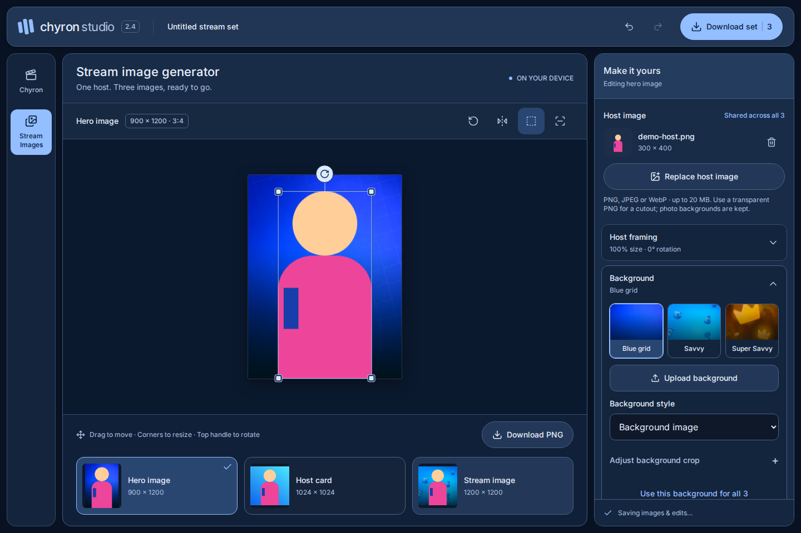

# Stream Images · Chyron Studio 2.4

Create three production-size graphics from one host image in the **Stream Images** tool.

## Workflow

1. Open **Stream Images** in the left tool rail on desktop, or the navigation below the header on mobile.
2. Upload or drop a host PNG onto the preview. All three images fill automatically. Transparent edges are excluded from the initial fit.
3. Select **Hero image**, **Host card** or **Stream image** below the preview. Edits apply to that output only.
4. Choose a supplied background, upload a custom background, or select a gradient/solid color. The color swatches and editable HEX fields customize the host card's colorful background.
5. Drag the host to move it, drag a corner handle to resize proportionally, or drag the round top handle to rotate. Hold Shift to snap rotation to 15°. Use the preview toolbar to fit, flip, or hide the handles. Open **Host framing** for exact values and full ±180° rotation. Arrow keys nudge the focused canvas, resize a focused corner or rotate a focused top handle; Shift makes larger steps. Escape cancels an active drag.
6. **Download PNG** exports the selected output. **Download set** creates one ZIP with all three PNGs.

| Output       | Pixels      | Aspect ratio | Filename suffix        |
| ------------ | ----------- | ------------ | ---------------------- |
| Hero image   | 900 × 1200  | 3:4          | `hero-900x1200.png`    |
| Host card    | 1024 × 1024 | 1:1          | `host-1024x1024.png`   |
| Stream image | 1200 × 1200 | 1:1          | `stream-1200x1200.png` |

Name the set in the header to change the download filename prefix. Uploading a replacement host updates all outputs while retaining their framing. Each image starts with the host centered near the bottom; proportions are preserved.

## Backgrounds and framing

The three supplied files are included as **Blue grid**, **Savvy** and **Super Savvy**. Their original pixels are retained in `public/assets/stream/`. Portrait backgrounds fill square outputs by cropping instead of stretching. Open **Adjust background crop** for horizontal/vertical position and zoom.

Up to eight custom backgrounds can be kept in a set. Select one to use it; **Remove custom background** removes it from the set and changes affected images to a color gradient. Undo restores it. **Use this background for all 3** copies the background settings while preserving each host's framing.

**Finishing** adds a host shadow or fades the host toward the bottom of the canvas. Background pixels remain intact. Safe-area guides and transform handles appear in the preview only; neither is drawn into exported PNGs.

## Image handling and saved drafts

- PNG, JPEG and WebP uploads are accepted. Maximum input: 20 MB, 24 megapixels and 10,000 pixels on either side.
- Transparent PNGs retain their cutout. JPEGs and opaque PNGs retain their original background; there is no automatic subject extraction.
- Selecting **Transparent** exports RGBA PNG with no background layer. Supplied opaque backgrounds produce opaque graphics.
- Uploaded images, custom backgrounds and all layout settings save together in this browser's IndexedDB. Wait for **Images & edits saved on this device** before closing the page.
- A storage failure is shown in the interface; editing and downloads remain available for the current session. Browser/site-data removal also removes the saved draft. The output ZIP contains rendered PNGs, not an editable project backup.
- Switching tools keeps Chyron and Stream Images mounted with separate undo histories. Chyron playback pauses when leaving that tool. Refresh restores the saved documents; undo histories belong to the current session.
- Images are processed on the device. No image upload service or runtime external asset host is used.

## Validation

The v2.4 update passed TypeScript, ESLint, the production build, **46 unit tests** and **8 targeted browser scenarios**. This adds mouse/touch corner resizing, full rotation, keyboard handles and exact PNG/preview pixel matching with guides and handles visible. Live-preview alpha and whole-subtitle hiding are verified through PNG/SVG downloads. See [v2.4 verification](verification-v2.4.json).

The v2.3 check passed TypeScript, ESLint, the production build, **32 unit tests** and **11 browser scenarios**, including the existing Chyron video/alpha exports. [Production verification](stream-verification.json) also records the host-fade/background pixel check and custom-background removal/undo. Original background bytes were compared against all three supplied files.

`tests/stream.test.ts` covers exact dimensions, independent defaults, transparent-margin fitting and aspect-preserving background cropping. `tests/browser/stream.spec.ts` exercises real PNG/ZIP downloads and decodes their pixels with FFmpeg, verifies alpha, persistence after reload, independent framing, pointer/keyboard positioning, undo, bad-upload recovery and switching back to Chyron.

Responsive checks cover 320, 393, 768, 844, 1024 and 1440 px widths, including a short landscape viewport. Axe checks cover the empty desktop workspace and a populated mobile workspace. Browser verification uses Chromium; real-device Safari and Firefox are not included in this run. The programmatic host drawing in tests is a synthetic fixture, not a bundled design asset.
